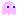

# CIIC 4010 Advanced Programming Second Project:
## OpenFrameworks-Pacman

## What is this project about?
This project is a recreation of the classic pac-man game with some twists like power ups and unique ghosts.
### Features Added:
- Ghosts spawn with different colors.    
- Pac-man can only have a maximum of 3 lives. 
- Map properly resets after restarting the game.
- Added a Power Up Class which includes the random power up and invisible power up classes.
- Added a Random Ghost. spawns every 500 points and gives the random power up.
- Added a Peek-A-Boo Ghost, spawns every 1000 points and gives the invisible power up.
- Added two new maps.
- Added two new skins.

### Key Bindings:
- w: move up.
- s: move down.
- a: move left.
- d: move right.
- n: kills the player.
- m: increases the player's health.
- spacebar: activates stored power up.
- c: changes the skin of the player to a familiar character from another game.
- v: changes the skin of the player to another familiar character from another game.
- y: toggles the win state.
- p: pauses the game.
- 1: changes the map to the second one.
- 2: changes the map to the last one.

